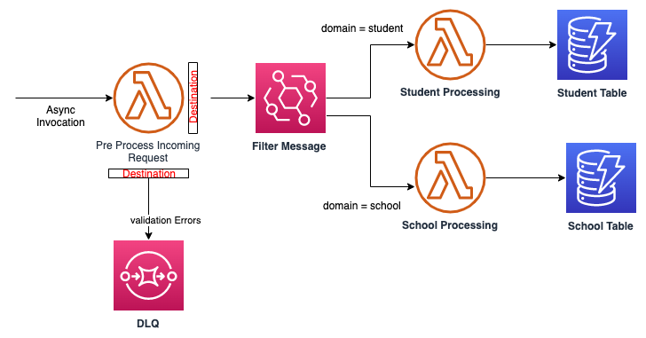
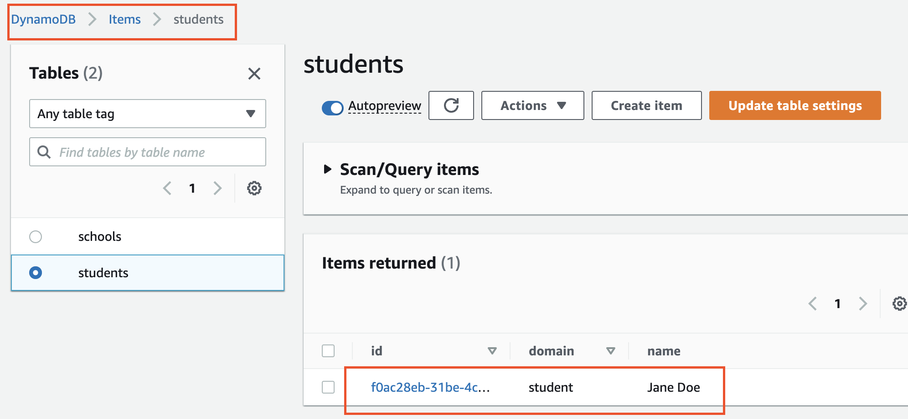
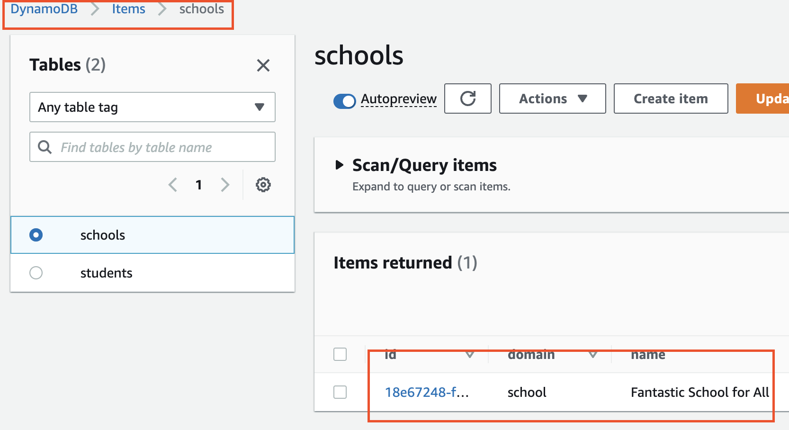
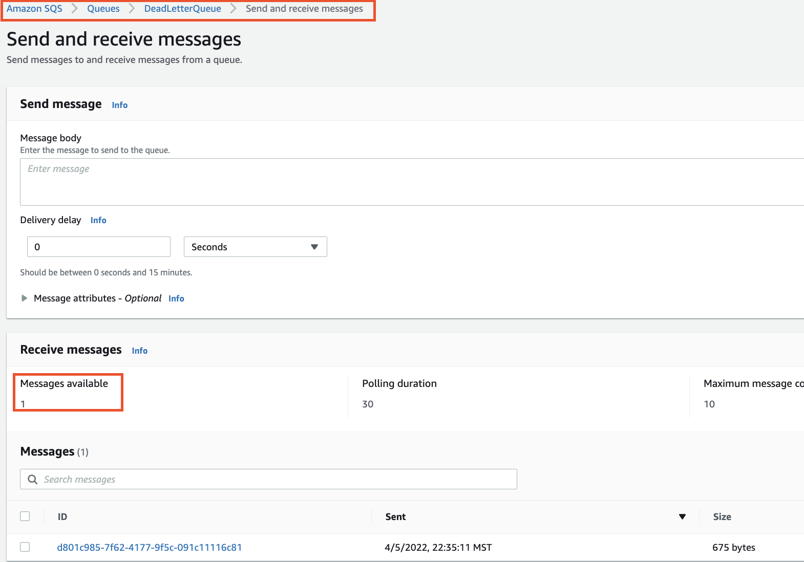

This CDK example demonstrates the usage of Lambda Destination to fan out processing via EventBridge.  
Below is the reference architecture:  



- [lib/event-patterns-stack.ts](lib/event-patterns-stack.ts): This is where the CDK application’s main stack is defined.  
   The stack will provision the resources described in the architecture above.  
   There are 2 flavors of the pre processing Lambda function. One that uses Lambda Destination and the other uses code to publish event to EventBridge. 

   

## Requirement

AWS CLI already configured with Administrator permission

## Build

To build this app, you need to be in this example's root folder. Then run the following:

```bash
npm install -g aws-cdk
npm install
npm run build
```

This will install the necessary CDK, this example's dependencies, and then build your TypeScript files and your CloudFormation template.

## Deploy

Run below to deploy / redeploy this Stack to your AWS Account.
``` 
cdk deploy
```


## Test

- First, lets test the lambda that publishes event via Code. Run below:
``` 
aws lambda invoke --function-name PreProcessorLambdaInCode --invocation-type Event --cli-binary-format raw-in-base64-out --payload '{"domain":"student","name":"Jane Doe"}' output.json
```
You should see StatusCode:202 in your terminal

Login to your AWS console and navigate to DynamoDB. You should see the student


- Next, lets create another student via Lambda with Destination. Run below:
```
aws lambda invoke --function-name PreProcessorLambdaUsingDestination --invocation-type Event --cli-binary-format raw-in-base64-out --payload '{"domain":"student","name":"Jack Jack"}' output.json
```
You should see StatusCode:202 in your terminal.  
Refreshing the DynamoDB `students` table will show the newly created student Jack. 


- You can test the EventBridge -  Event Patterns by passing different domain in the payload to above lambda function.  
 ``` 
aws lambda invoke --function-name PreProcessorLambdaUsingDestination --invocation-type Event --cli-binary-format raw-in-base64-out --payload '{"domain":"school","name":"Fantastic School for All"}' output.json 
``` 

You should see StatusCode:202 in your terminal

Login to your AWS console and navigate to DynamoDB. You should see the school record.  


- You can also test the DLQ integration by passing empty payload.
```
aws lambda invoke --function-name PreProcessorLambdaUsingDestination --invocation-type Event --cli-binary-format raw-in-base64-out --payload '{}' output.json 
```

Login to your AWS Console and navigate to SQS. You should see a new message in DeadLetterQueue.
  


 
## Cleanup

To avoid unexpected charges to your account, make sure you clean up your CDK stack.

```
cdk destroy
```

## To-DO 

Add Unit Test
