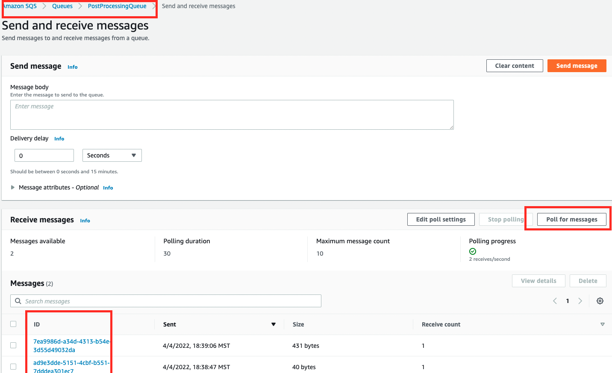
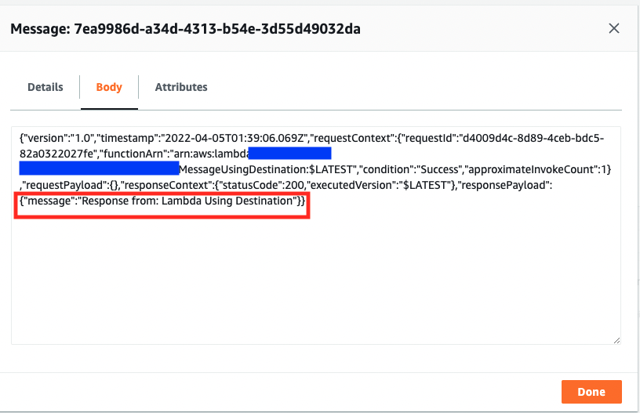

This stack contains two lambda functions that demonstrate before / after implementation using Lambda Destination to extract sending message.
- [lib/sqs-destination-stack.ts](lib/sqs-destination-stack.ts): This is where the CDK application’s main stack is defined.  
   The stack will provision:  
   - SQS Queue called 'PostProcessingQueue'
   - 2 Lambda functions to send message to above SQS.
- [bin/sqs-destination.ts](bin/sqs-destination.ts) is the entrypoint of the CDK application. It will load the stack defined in lib/sqs-destination-stack.ts.
- [lambda/before/SendMessageInCode.js](lambda/before/SendMessageInCode.js) : This lambda sends message to SQS in the code.
- [lambda/after/SendMessageUsingDestination.js](lambda/after/SendMessageUsingDestination.js): This lambda extracts the sending of the message to the SQS from the code.  
Instead the relationship between the Lambda and SQS is defined using `onSuccess` prop when defining the function in [sqs-destination-stack.ts](lib/sqs-destination-stack.ts)  

## Requirement

AWS CLI already configured with Administrator permission

## Build

To build this app, you need to be in this example's root folder. Then run the following:

```bash
npm install -g aws-cdk
npm install
npm run build
```

This will install the necessary CDK, this example's dependencies, and then build your TypeScript files and your CloudFormation template.

## Deploy

Run below to deploy / redeploy this Stack to your AWS Account.
``` 
cdk deploy
```


## Test the functionality

- First, lets test the SendMessageInCode lambda:
``` 
aws lambda invoke --function-name SendMessageInCode --payload '{}' output.json
```
You should see StatusCode:200

- Next, lets test the SendMessageUsingDestination lambda to message to SQS using Lambda Destination
 ``` 
 aws lambda invoke --function-name SendMessageUsingDestination --invocation-type Event --payload '{}' output.json
 ``` 
You should see StatusCode:202    
*Note*: Lambda using destination only supports Asynchronous invocation and hence `--invocation-type Event` is used above.


## Verify

Login to your AWS console and navigate to Amazon SQS -> Queues -> PostProcessingQueue.  
You should see 2 messages in the Queue.   



---
Message send via Lambda destination contains the details of the function, its context, and the request and response payloads. 


## Cleanup

To avoid unexpected charges to your account, make sure you clean up your CDK stack.

```
cdk destroy
```

## To-DO 
 
Add Unit Test