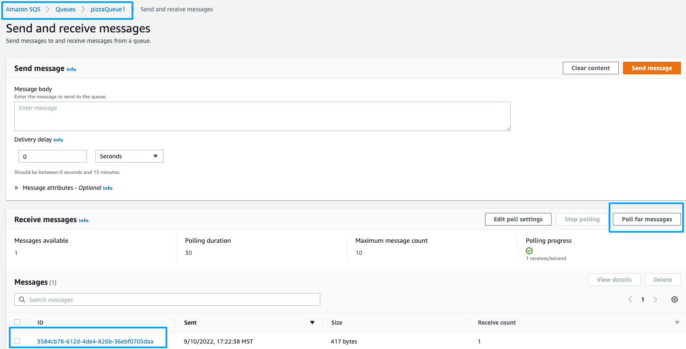

# Extract  AWS Lambda by AWS Step Functions SDK integrations
This project is the CDK implementation of ['Extract Send Message'](../../patterns/extract_send_message.md) pattern. This patterns shows how you use a Lambda Destination in CDK to send message to SQS and make the application topology explicit.


## How it works
We have OrderPizza Lambda that processes the request and then sends message to SQS to downstream processing.

Project uses 2 CDK stacks to demonstrate before and after refactoring:
- [lib/send-message-from-code.ts](lib/send-message-from-code.ts) This stack creates a Lambda which publishes message to SQS directly from code.
- [lib/send-message-from-destionation.ts](lib/send-message-from-code.ts) This stack creates a Lambda where message sending is extracted from code and wired in CDK using Lambda Destinat  

---
## Deploy the infrastructure


To build this app, navigate to `implementation/extract-send-message` folder. Then run the following:

```bash
npm install -g aws-cdk
npm install
npm run build
```

This will install the necessary CDK, dependencies, build your TypeScript files and CloudFormation template.

Next, deploy the 2 Stacks to your AWS Account.
``` 
cdk deploy --all
```


## Testing it out

- First, lets invoke the lambda that sends message from code:
``` 
aws lambda invoke --function-name OrderPizza --invocation-type Event --payload '{}' output.json
```
You should see StatusCode:200

- Next, lets test the lambda which is refactored to uses Lambda Destination
 ``` 
aws lambda invoke --function-name OrderPizzaUsingDestination --invocation-type Event --payload '{}' output.json
``` 

You should see StatusCode:202     

*Note*: We used `--invocation-type Event`  above because Lambda Destination only supports Asynchronous invocation.


## Verify

Login to your AWS console and navigate to Amazon SQS.  
You should see 2 Queues.



Inspect the message on each Queue using 'Poll Messages'  


## Cleanup

```
cdk destroy --all
```

## To-DO 
 
Add Unit Test