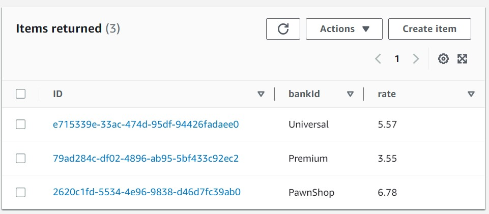

# Convert Orchestration to Choreography
This project is the CDK implementation of ['Convert Orchestration to Choreography'](https://serverlessland.com/refactoring-serverless/orchestration-to-choreography) pattern. It shows how you can convert the interaction approach from orchestration to choreography without changing the functionality.

## How it works
The scenario is to simulate a mortgage enquiry use case. The broker receives an enquiry from a loan applicant, and then distributes the request to a number of banks. After receiving the offers from the banks, the broker will aggregate the results and return to the applicant. 

In the orchestration solution, a Step Functions State Machine is used to coordinate the interactions between a number of tasks which involve the different parties, and ultimately complete the workflow. In the choreography solution, there is no central coordinator to facilitate the interactions, and the parties don't talk to each other directly. They actually don't know or even don't care about the existence of other parties. Each party simply publishes the message to SNS topic or SQS queue, and the other parties will subscribe and consume the message from the topic or the queue if they are interested in this type of the message. In this way, a loose-coupling architecture is achieved since all the involved parties don't need to know the existence of others and there is no direct communication between one another.

The code will deploy 2 CloudFormation stacks:
- OrchestrationStack: Here is the State Machine that invokes a number of Lambda functions, coordinates the communication, and completes the workflow.
- ChoreographyStack: Here are a number of tasks (in the form of Lambda function), which operate independently without coupling with each other. They use Publisher/Subscriber pattern and message to queue to work together asynchronously and ultimately achieve the same result as an explicit workflow.

---
## Deploy the infrastructure


To build this app, navigate to `implementation/orchestration-to-choreography` folder. Then run the following:

```bash
npm install -g aws-cdk
npm install
```

This will install the necessary CDK, dependencies, build your TypeScript files and CloudFormation template.

Next, deploy the 2 Stacks to your AWS Account (`OrchestrationStack` and `ChoreographyStack`):
``` 
cdk deploy --all
```


## Testing it out

1. First, in the orchestration scenario, the coordinator needs to know all the involved parties (e.g. the list of banks). Let's create a record in DynamoDB to provide the bank list. You can do this in AWS Console or CLI. The CLI command is shown as below:
 ```
aws dynamodb put-item --table-name LoanBrokerBanks --item '{"Type": {"S": "Home"}, "BankAddress": {"L": [{"S": "BankRecipientPawnshop"}, {"S": "BankRecipientUniversal"}, {"S": "BankRecipientPremium"}]}}'
```

2. Next, we can perform the Step Functions State Machine:
    - Go to the AWS Console and then to Step Functions
    - Click on the LoanBroker State Machine
    - Click the Start Execution button and enter this input: `{"SSN": "123-45-6789", "Amount": 400000, "Term": 30 }`
    - After a few seconds, all the states should turn green.
    - Click on the Map state, and choose "View Map state overview", in the "Output" tab, you should be able to see the bank offers.
 ```
{
  "SSN": "123-45-6789",
  "Amount": 400000,
  "Term": 30,
  "Credit": {
    "Score": 511,
    "History": 25
  },
  "Banks": {
    "BankAddress": [
      "BankRecipientPawnshop",
      "BankRecipientUniversal",
      "BankRecipientPremium"
    ]
  },
  "Quotes": [
    {
      "Quote": {
        "rate": 8.180046213479706,
        "bankId": "PawnShop"
      }
    },
    ...
  ]
}
 ```

3. Now, let's test the choreagraphy scenario and validate it can achieve the same functionality. We can perform the Step Functions State Machine defined to issue a message to SNS topic:
    - Go to the AWS Console and then to Step Functions
    - Click on the LoanBroker-PubSub State Machine
    - Click the Start Execution button, name it as `mysnsrun`, and enter this input: `{"SSN": "123-45-6789", "Amount": 400000, "Term": 30 }`
    - All the states should immediately turn green

4. After a short while, you should be able to see the generated quotes from the three banks in table MortgageQuotes in DynamoDB.
    - Go to the AWS Console and then to DynamoDB
    - Click on "Tables/Explore items" in the left-side menu
    - Select table MortgageQuotes
    - One example is shown as below. We use the State Machine execution ID to uniquely identify this enquiry. The ID should be like "arn:aws:states:region-1:account-1:execution:LoanBroker-PubSub:mysnsrun".

<p align="center"></p>

## Cleanup

```
cdk destroy --all
```