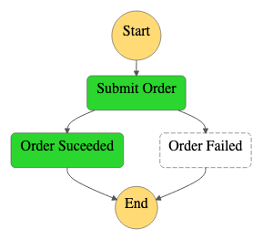

# Replace Polling with Callback

This project is the CDK implementation of the pattern ['Replace Polling with Callback'](../../patterns/replace_polling_with_callback.md). It shows how you can use AWS Step Function's 'Wait for task token' integration pattern which calls a service with a task token and waits until that token is returned with a payload.

## How it works
The State Machine receives a new pizza order which is written to an SQS queue and processed by a Lambda Function responsible for pizza baking which can take it's time. The workflow returns a success message once the pizza is ready. 


The code will deploy two versions of the AWS Step Function State Machines. 
- Order pizza and poll for the result: This uses step function's Wait state and a Lambda invocation to periodically pull for the result, wait a specified time, and retry until to receive the result.
- Order pizza with a callback: This uses step function's Wait for a Callback with the Task Token to receive the result. [replace-polling-with-callback-refactored.ts]


## Deploy the infrastructure

The [AWS CLI v2](https://docs.aws.amazon.com/cli/latest/userguide/getting-started-install.html) configured with certain permissions to create those resources. 

### Build

To build this app, you need to be in this example's root folder. Then run the following:
```bash
npm install
npm run build
cdk synth
```

This will install the necessary CDK, this example's dependencies. It compiles typescript to js and emits the synthesized CloudFormation template for this stack.

### Deploy

0. Bootstrap the environment if you have not used AWS CDK in the deployment region for your account
``` 
cdk bootstrap
```

1. Run below to deploy / redeploy this Stack to your AWS Account:
``` 
cdk deploy --all
```

2. Select `y` to create the stack:
`Do you wish to deploy these changes (y/n)?`

## Testing it out

- First, let's invoke the state machine that polls for the message:
``` 
aws stepfunctions start-execution \
--state-machine-arn <state-machine-arn> \
--input "{\"name\" : \"pizza_callback\", \"order\" : \"pizza margherita\", \"waitTime\" : \"5\"}"
```

You should seefollowing output in in the AWS CLI:
``` 
{
    "executionArn": <execution-arn>,
    "startDate":  <start-date>
}
```

- Next, let's invoke the state machine that uses the callback integration pattern:
``` 
aws stepfunctions start-execution \
--state-machine-arn <state-machine-arn> \
--input "{\"name\" : \"pizza_callback\", \"order\" : \"pizza funghi\"}"
```

You should seefollowing output in in the AWS CLI:
```  
{
    "executionArn": <execution-arn>,
    "startDate":  <start-date>
}
```

## Validate

The polling example should show the following execution graph: 
<p align="center">

</p>


The callback example should show the following execution graph: 
<p align="center">

</p>

## Clean up

1. Remove your CDK stack:
```
cdk destroy --all
```

2. Select `y` to delete the stack:
Are you sure you want to delete: <stack-names> (y/n)?


