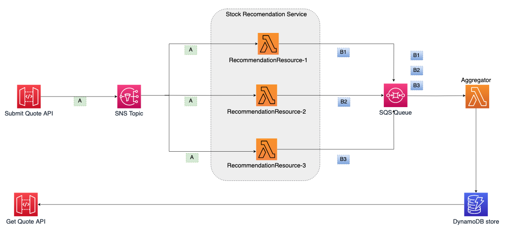
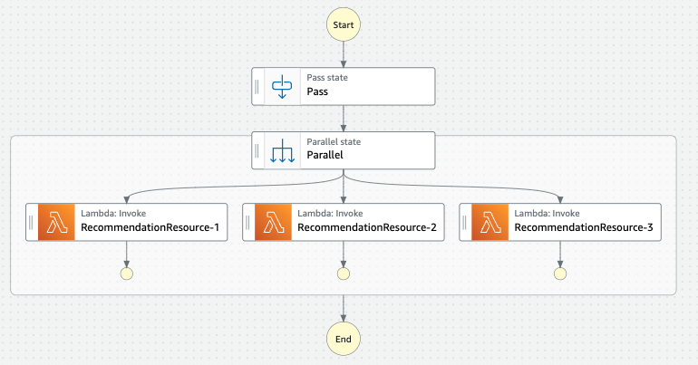

# Convert Choreography to Orchestration

***

***

## Description:

Choreography and Orchestration are two modes on how distributed microservices services can communicate with each another.

In Choreography, every service works independently and achieves communication without tight control. Events flow between services without any centralized coordination. Each microservice listens for events of it's interest and does its own thing, following the event-driven paradigm

In orchestration, there is a central service (the ‘orchestrator’) that controls the interaction between services. It coordinates the interaction and order in which services are invoked like a control flow for the business logic. 

Many applications use both choreography and orchestration for different use cases. Communication between [bounded contexts](https://martinfowler.com/bliki/BoundedContext.html) is often how choreography is used most effectively, within a bounded context, you need to control the sequence of service integration, maintain state, and handle errors and retries. A standard guideline is to use orchestration within the bounded context of a microservice, but use choreography between bounded-contexts. 

The following article presents a comprehensive illustration of two interaction patterns, highlights their pros and cons, and gives the advice how to select or combine them within a given context.

[Choreography vs Orchestration in the land of serverless](https://theburningmonk.com/2020/08/choreography-vs-orchestration-in-the-land-of-serverless/)

## Solution:

AWS Step Functions is a serverless orchestration service. A workflow in Step Functions is called a state machine, which simplifies implementation of common tasks and supports features like retries, handling failures, parallelization, service integrations, and observability. 

As an example to convert Choreography to Orchestration by using AWS Step Function, here is the CDK implementation written in Typescript: [/implementation/choreography-to-orchestration](/implementation/choreography-to-orchestration)

## Advantages:

- Easier to implement as one system controls the flow between components. The work flow is modelled and version controlled

- Simplifies end-to-end monitoring, reporting using built in visualization and audit histories.
 
- Transaction management and Error management - easier to handle transaction errors, timeout, retries etc. 

- Centralized business logic - everything can be seen in one place. No need for architecture diagrams and supporting documents. 

## Limitations: 

- Additional costs when using the Orchestration service. For example, AWS Step functions charges for the total number of state transitions per month after exceeding the initial 4,000 free state transitions per month. AWS Step Functions counts a state transition every time a step of your workflow is executed. For example for 50K requests it costs 3.96 using the original architecture and the refactored architecture using AWS step functions costs 4.90. 

- The central coordinator system can be a single point of failure.  

- Tight coupling of services with the orchestrator. 

- Less flexible to add individual components, Need to test the whole system for small changes in workflow. 

## Applicability : 

The refactoring can be applied to workflows where you want a centralized control over the interactions between microservices, to have a unified view of the system, and make it easier to troubleshoot and make decisions. Especially when thinking about a complex architecture featuring dozens of services

## Related Refactoring: 

[Convert Orchestration to Choreography](patterns/choreography-to-orchestration.md)