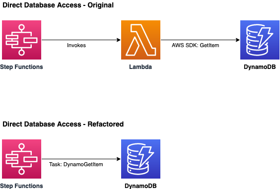

# Direct Database Access

## Description

Reading data from DynamoDB is traditionally done using a Lambda function. With the introduction of Step Function integrations, this implemetation can be simplified. You can leverage the DynamoGetItem Step Functions integration to execute a read operation in DynamoDB without the need to invoke a Lambda function. This will improve the architecture by removing the Lambda invocation which will reduce the execution time and it will also help reducing cost.

## Solution

Use [Step Functions Integrations](https://docs.aws.amazon.com/step-functions/latest/dg/connect-supported-services.html) to execute read operations in DynamoDB and remove the need to invoke a Lambda function.

For a CDK implementation written in Typescript, please see [/implementation/direct-database-access](/implementation/direct-database-access).

### Advantages
* Removes the need to invoke a Lambda function to execute read operations in DynamoDB.

* Simplifies the architecture and makes the implementation explicit.

* Improves performance and helps reducing response times and latency.

* Lowers cost by reducing the use of cloud resources.

### Limitations

* It might not be applicable where the Lambda function performs a transformation after data has been read from DynamoDB

* It might not be applicable where the Lambda function performs a transformation before creating a new item in DynamoDB

### Applicability

* This refactoring can be applied to workloads that use Lambda functions to execute DynamoDB operations. 

## Related Refactorings
