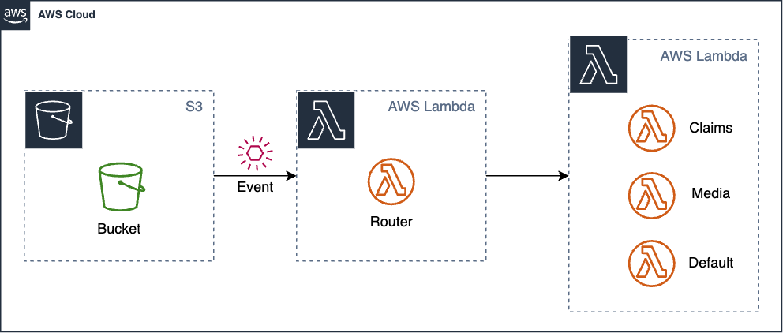
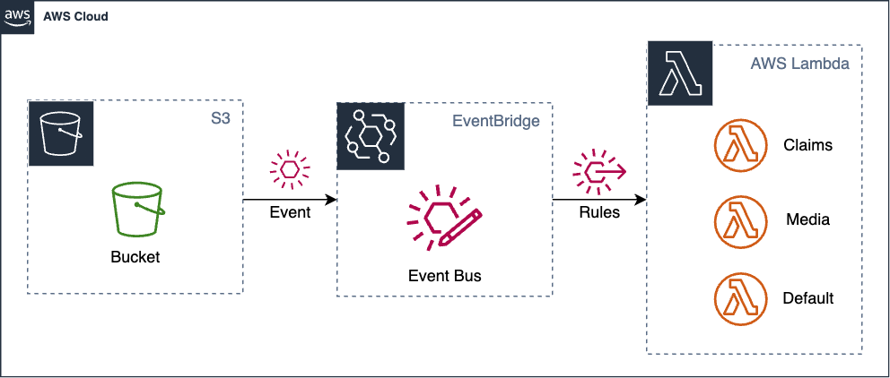

# Extract Message Router

Original:


Refactored:


## Description

When implementing business logic directly in your application code, you may need to write custom code to handle message routing and processing. This can quickly become complex and time-consuming, especially as your system grows and the number of events increases. By contrast, EventBridge rules provide a simple and flexible way to define event routing, allowing you to offload this responsibility from your application code. 

An example might look as follows:

```
# Initialise clients
const { LambdaClient, InvokeCommand } = require('@aws-sdk/client-lambda');
const lambdaClient = new LambdaClient();

exports.handler = async (event, context) => {

    domain_object = # business logic here

    switch (domain_object.attribute) {
      case 'value1':
        new InvokeCommand({
              FunctionName: service1,
              InvocationType: 'Event',
              Payload: payload
            });
        break;
      case 'value2':
        new InvokeCommand({
              FunctionName: service2,
              InvocationType: 'Event',
              Payload: payload
            });
        break;
        ...
    }
    await lambdaClient.send(invokeCommand);
}
```

## Solution

Use EventBridge rules to route messages to different downstream services (see [docs](https://docs.aws.amazon.com/eventbridge/latest/userguide/eb-rules.html))
You can find the CDK implementation of this solution [here](https://github.com/aws-samples/aws-refactoring-to-serverless/blob/main/implementation/extract-message-router/README.md).

## Considerations 

### Advantages
* The event routing is now explicitly defined within automation code as opposed to in the aplication code. This makes the application topology more explicit.
* Routing can be changed without changing the source code.
* Configurable [retry policies and dead-letter queues](https://docs.aws.amazon.com/eventbridge/latest/userguide/eb-rule-dlq.html) per target.

### Applicability

* EventBridge rules have less flexibility than the source code, especially if you need to implement complex event patterns.


