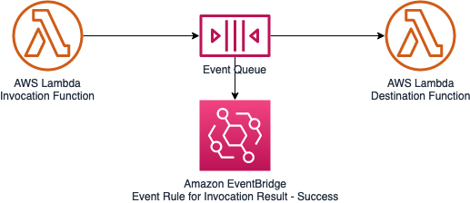

# Extract function invocation


The picture shows an AWS Lambda function asynchronously invoking another function. When the function returns a success response or exits without throwing an error, Lambda sends a record of the invocation to an EventBridge event bus.

<p align="center">

</p>


## Description 

Invoking Lambda functions asynchronously from within the function code hides the application topology inside the code. You can configure separate destinations for events that fail processing and events that are successfully processed.

The example might look like: 
``` 
const aws = require('aws-sdk');
const lambda = new aws.Lambda();

exports.handler = async function(event, context) {
    ...
    // Prepare invokation params 
    var params = {
        FunctionName: process.env.FUNCTION_NAME,
        InvocationType: Event,
        Payload: JSON.stringify(event),
    };
    // Invoke the destination function 
    await lambda.invoke(params).promise();
    ...
};
```

## Solution

Use a Lambda Destination to send the message and configure the Lambda destination in CloudFormation or CDK to make the application topology explicit.

In CDK, you either pass the destination on the Lambda Function constructor or add it later via the [`LambdaDestination`](https://docs.aws.amazon.com/cdk/api/v2/docs/aws-cdk-lib.aws_lambda_destinations.LambdaDestination.html) resource.

```
    new lambda.Function(this, 'invocationRefactored', {
      functionName: 'invocationFnRefactored',
      runtime: lambda.Runtime.NODEJS_14_X,
      code: lambda.Code.fromAsset('lambda/invocation-refactored'),
      handler: 'index.handler',
      onSuccess: new LambdaDestination(destinationFn, { // Uses CDK's Lambda Destination  
        responseOnly: true,
      }),
    }); 
```

## Considerations

### Advantages 
* Extracting the function invocation into a destination makes the application topology explicit and separates compsition from application logic

### Applicability

* Lambda Destinations are triggered only for *asynchronous* invocations. Therefore, this refactoring cannot be applied to synchronous invocations, e.g. from the console (Test). If your functions returns a synchronous result, this is now replaced by the message to be sent

* Lambda Destinations are triggered at the end of the function execution whereas the code could send the message at any place

* Invoking a functinon from [AWS SDK](https://docs.aws.amazon.com/AWSJavaScriptSDK/v3/latest/clients/client-lambda/interfaces/invokecommandinput.html) allows you to set additional attributes like `ClientContext`, `InvocationType`, `LogType`, `Qualifier`. You cannot set these attributes from a Lambda destination. Setting `InvocationType` for example allows for synchronous invocations

* Lambda Destinations have the option to send the response payload only via `responeOnly`, not the full record. This allows to easily chain asynchronous Lambda functions without having to deal with data extraction in the runtime code. ([`LambdaDestinationOptions`](https://docs.aws.amazon.com/cdk/api/v2/docs/aws-cdk-lib.aws_lambda_destinations.LambdaDestinationOptions.html))

* Consider building event driven architectures using the other Destination types (SNS, SQS, Eventbridge)


## Related Refactorings 
* [Extract Send Message](patterns/extract_send_message.md)

## Related Resources
* https://aws.amazon.com/blogs/compute/introducing-aws-lambda-destinations/
* https://docs.aws.amazon.com/lambda/latest/dg/lambda-invocation.html
