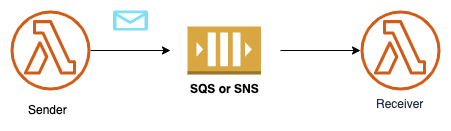

# Extract Send Message 



## Description

Sending a message to an SQS or an SNS channel directly from Lambda function code hides the application topology inside the function code - to understand the flow of messages one has to look inside the code.

An example might look as follows:

```
queue_name = os.environ['SQS_NAME']
sqs = boto3.resource('sqs')
queue = sqs.get_queue_by_name(QueueName=queue_name)

def handler(event, context):
   ...
  response = queue.send_message(MessageBody='world')
```

## Solution

Use [Lambda Destination ](https://aws.amazon.com/blogs/compute/introducing-aws-lambda-destinations/) to send the message and configure the channel name in CDK or CloudFormation to make the application topology explicit.

For a CDK implementation written in Typescript, please see [/implementation/extract-send-message](/implementation/extract-send-message).

## Considerations 

### Advantages
* Extracting the message sending into a destination makes the application topology explicit and separates compsition from application logic

### Applicability

* Lambda Destinations are triggered only for *asynchronous* invocations. Therefore, this refactoring cannot be applied to synchronous invocations, e.g. from the console. If your functions returns a synchronous result, this is now replaced by the message to be sent

* Lambda Destinations are triggered at the end of the function execution whereas the code could send the message at any place. However, as the consumptionm of the SQS or SNS channel takes place asynchronously, this won't affect the overall flow.

* Sending a message from code allows you to set additional attributes like [`MessageDeduplicationId `](https://boto3.amazonaws.com/v1/documentation/api/latest/reference/services/sqs.html#SQS.Client.send_message) or `DelaySeconds`. You cannot set these attributes from a Lambda destination.

* Destinations that invoke another Lambda function have the option to send the message body only, i.e. the data structure that your function returns (via the `responseOnly` option in [`LambdaDestinationOptions`](https://docs.aws.amazon.com/cdk/api/v2/docs/aws-cdk-lib.aws_lambda_destinations.LambdaDestinationOptions.html)). No such option exists for destinations that send messages to SQS or SNS. The message therefore includes the event wrapper and the actual data structure inside the `detail/responsePayload` element. This change will affect downstream event consumers. To maintain the same message format without the wrapper, you would need to direct the destination to an EventBridge, which filters the message content and then passes it onto the SQS chanel or SNS topic. An example of this is shown in the [Loan Broker CDK Example](https://github.com/spac3lord/eip/blob/master/LoanBroker/AwsStepFunctions/PubSub/LoanBrokerPubSub.yml)


## Related Refactorings
[Extract Message Filter](extract_message_filter.md)