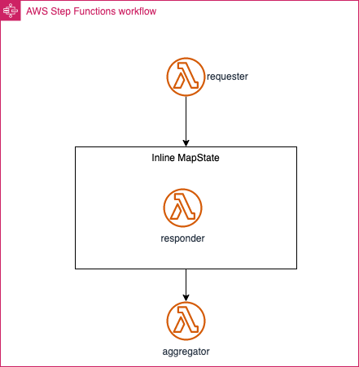

# Replace Map with Scatter-Gather

## Description

The scatter-gather routes a request message to multiple recipients and re-aggregates the responses into a single response message. There are two variants of the Scatter-Gather that use different mechanisms to send the request messages to the intended recipients:

* Distribution via a Recipient List allows the Scatter-Gather to control the list of recipients but requires the Scatter-Gather to be aware of each recipient's message channel.
* Auction-style Scatter-Gathers use a Publish-Subscribe Channel to broadcast the request to any interested participant. This option allows the Scatter-Gather to use a single channel but at the same time relinquishes control.

AWS Step Function Map state executes a set of AWS Lambda functions in parallel, passing each function an input value from an array of inputs. The output of each Lambda function is collected and aggregated by the Map state, and then returned as a single result.



An example Workflow definition looks like that:

``` JSON
{
  "Comment": "Scatter/Gather pattern using Map state",
  "StartAt": "requester",
  "States": {
    "requester": {
      "Type": "Task",
      "Resource": "${REQUESTER_ARN}",
      "ResultPath": "$",
      "ResultSelector": {
        "body.$": "States.StringToJson($.body)"
      },
      "Next": "Map"
    },
    "Map": {
      "Type": "Map",
      "ItemProcessor": {
        "ProcessorConfig": {
          "Mode": "INLINE"
        },
        "StartAt": "responder",
        "States": {
          "responder": {
            "Type": "Task",
            "Resource": "${RESPONDER_ARN}",
            "ResultPath": "$",
            "ResultSelector": {
              "body.$": "$.body"
            },            
            "End": true
          }
        }
      },
      "Next": "aggregator",
      "ItemsPath": "$.body"
    },
    "aggregator": {
      "Type": "Task",
      "Resource": "${AGGREGATOR_ARN}",
      "Parameters": {
        "Records.$": "$"
      },      
      "End": true
    }
  }
}
```

AWS Step Functions map state provides a powerful and flexible way to implement the Scatter-Gather pattern, but there are some limitations and considerations that you should be aware of:

* Error Handling: If any of the parallel executions within a Map state fail, the entire Map state is considered as failed. However, you can use "Catch" and "Retry" fields to define custom error handling and retry policies for individual items.
* Completion: The Map state will wait for all parallel executions to complete before it moves to the next state in the workflow. This can lead to increased processing time if some executions take significantly longer than others.
* Cost: Step Functions has a cost associated with it based on the number of state transitions and the duration of execution. That could be the case for high-throughput scenarios.
* Complexity: The implementation with AWS CDK for Step Functions Map state may be more complex due to the need to define the state machine, states, and transitions. However, it provides better control over the workflow orchestration and error handling.

## Solution

Use AWS SNS and SQS to implement Scatter-Gather pattern to simplify application complexity and architect for scale.

Replace Step Functions ```Map``` step, send a message to SNS


Using SNS and SQS to implement Scatter-Gather can simplify application complexity by decoupling sub-tasks, providing scalability and flexibility, enabling reusability, and allowing for asynchronous processing. This can make it easier to develop, test, and maintain complex workflows, while also improving application performance and reliability.

Lambda functions invoked in scatter-gather pattern:

``` Python
class LambdaStates(Construct):
    
    def __init__(self, scope: Construct, id_: str, requester_sns_topic:sns.ITopic = None, responder_sqs_queue:sqs.IQueue = None, **kwargs) -> None:
        super().__init__(scope, id_)
        
        requester_destination = None
        env_req = {}
        if requester_sns_topic is not None:
            requester_destination = destinations.SnsDestination(requester_sns_topic)
        else:
            env_req = {"MAX_SCATTER": self.node.try_get_context("max_scatter")}
            
        self.requester = lambda_.Function(
            self,
            f"requester",
            ...
            on_success=requester_destination            
        )
        
        responder_destination = None
        env_resp = {}
        if responder_sqs_queue is not None:
            responder_destination = destinations.SqsDestination(responder_sqs_queue) 
            # necessary since lambda destinations only works with asynchronous invocations. Using lambda with SQS is synchronous (https://docs.aws.amazon.com/lambda/latest/dg/with-sqs.html). 
            env_resp = {
                "SQS_QUEUE_URL": responder_sqs_queue.queue_url
            }
            
        self.responder = lambda_.Function(
            self,
            f"responder",
            ...            
            on_success=responder_destination,
            environment=env_resp
        )
        
        self.aggregator = lambda_.Function(
            self,
            f"aggregator",
            ...
        )
```

CDK code to implement Scatter-Gather with SNS and SQS:

``` Python
    # get max_scatter parameter. determines the number of sub-tasks/queues for scatter-gather pattern.
    max_scatter = int(self.node.try_get_context("max_scatter"))
    #create SNS topic
    sns_fanout = sns.Topic(
        self, "ScatterTopic",
        topic_name="scatter-topic"
    )
    # create aggregator sqs queue
    sqs_aggregator = sqs.Queue(self, "sqs-aggregator", visibility_timeout=Duration.seconds(90))
    lambdas = LambdaStates(self, "refactor-lambda", requester_sns_topic=sns_fanout, responder_sqs_queue=sqs_aggregator)
    
    # create MAX_SCATTER sqs queues and subscribe to SNS topic
    sqs_queues = []
    for queue_num in range(0, max_scatter):
        t_queue = sqs.Queue(self, f"sqs-{queue_num}")
        sns_fanout.add_subscription(subscriptions.SqsSubscription(t_queue,
                                                            raw_message_delivery=True,
                                                        )
                                    )
        t_queue.grant_consume_messages(lambdas.responder)
        lambdas.responder.add_event_source(_event.SqsEventSource(t_queue))
        sqs_queues.append(t_queue)
    
    
    lambdas.aggregator.add_event_source(_event.SqsEventSource(queue=sqs_aggregator, batch_size=max_scatter, max_batching_window=Duration.minutes(1)))
```

### Assumptions

* Scatter-Gather variant with controlled recipient list.
* Sub-Tasks (scatter) need to be decoupled and independent.

### Advantages

* Decoupling: By using SNS and SQS to pass messages between sub-tasks, you can decouple the individual sub-tasks from each other, reducing the complexity of the overall workflow. This can make it easier to modify or replace individual sub-tasks without affecting the rest of the system.
* Scalability: SNS and SQS provide a scalable and flexible architecture that can handle large volumes of messages and sub-tasks. This can make it easier to scale your application as your workload grows.
* Reusability: By using SNS and SQS to pass messages, you can make your sub-tasks more reusable, as they can be used in different workflows and applications. This can simplify development and testing, as well as reduce maintenance costs.
* Asynchronous processing: By using SNS and SQS, you can implement asynchronous processing of sub-tasks, which can improve application performance and responsiveness. This can also make it easier to handle bursts of traffic or spikes in workload, as messages can be queued up and processed as resources become available.
* Complexity: The implementation with AWS CDK for SNS/SQS is relatively simpler, as you only need to define an SNS topic and subscribe one or more SQS queues to that topic.

### Limitations

* Complexity: Implementing Scatter-Gather using SNS and SQS can add complexity to your application, as you need to manage aggregation of results. This can require additional development effort.
* Auditability: SNS/SQS does not provide same auditability as AWS Step Functions which allows to visualize and monitor the progress of your workflow via console or API.
* Traceability: To allow for message aggregation and enable request identification, each message should include a unique ID.

### Applicability

AWS SNS and SQS are best suited for workflows that involve small or moderately sized messages in a structured format, are relatively simple in nature, and do not require a high degree of control and orchestration. They are suitable for loosely coupled systems, allowing for asynchronous processing and eventual consistency. While SQS does provide some error handling and fault tolerance features, such as retries and visibility timeouts, more complex error handling may be better managed by Step Functions. SNS and SQS work well with other AWS services, like Lambda, and can be more cost-effective for high-throughput scenarios. If your workflow requires more advanced features or capabilities, such as support for complex orchestration, advanced error handling, or processing large payloads, Step Functions may be a better option.

### Considerations

Choosing between AWS Step Functions Map state and AWS SNS/SQS depends on your use case and requirements. Use Step Functions if you need a tightly orchestrated workflow with built-in scatter-gather and error handling capabilities. Choose SNS and SQS for loosely coupled, highly scalable, and asynchronous processing where you can manage the aggregation of results separately.

## Related Refactorings

* [Extract Send Message](https://serverlessland.com/refactoring-serverless/extract-send-message)
  