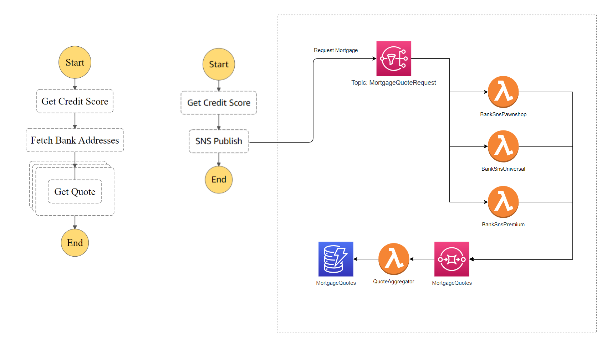

# Convert Orchestration to Choreography

## Description

Choreography and Orchestration are two modes of interaction in a microservices architecture.

In orchestration, there is a controller (the ‘orchestrator’) that controls the interaction between services. It dictates the control flow of the business logic and makes sure that everything happens on cue. This follows the request-response paradigm. The orchestration might make the system appear more coupled. However, it provides better control and visibility for the whole system and it is easy to change the workflow in a central location.

In choreography, every service works independently. There are no hard dependencies between them, and they are loosely coupled only through shared events. Each service listens for events that it’s interested in and does its own thing. This follows the event-driven paradigm. The advantage is loose coupling, however, getting the complete system picture can be a challenge.

There are pros and cons to use these two patterns. As a simple rule, you should prefer orchestration within the bounded context of a microservice, but prefer choreography between bounded contexts.

The following article presents a comprehensive illustration of two interaction patterns, highlights their pros and cons, and gives the advice how to select or combine them within a given context.

[Choreography vs Orchestration in the land of serverless](https://theburningmonk.com/2020/08/choreography-vs-orchestration-in-the-land-of-serverless/)

## Solution

Step Functions is one choice to implement orchestration. The order flow is modelled as a state machine.

Various asynchronous message services can be used to implement event-driven system, where the components communicate with each other in a choreography approach. Amazon Simple Notification Service (SNS), Amazon Simple Queue Service (SQS), Amazon EventBridge, Amazon Kinesis, and Apache Kafka are some examples of this kind of service.

As an example to convert orchestration to choreography by using SNS and SQS, here is the CDK implementation written in Typescript. please see [/implementation/orchestration-to-choreography](/implementation/orchestration-to-choreography). This example is inspired by [Serverless Loan Broker @AWS, Part 3: Publish-Subscribe with SNS](https://www.enterpriseintegrationpatterns.com/ramblings/loanbroker_stepfunctions_pubsub.html)

### Advantages
* Loose coupling. Each step of the flow can be changed independently.

* Each step of the flow can be scaled independently.

* No single point of failure.

* Extendability. Other systems can subscribe these events and introduce new functionality. 

* The events are useful artefacts on their own, e.g. they can be fed into a data lake to generate business intelligence reports. 

* Lower cost compared with Step Functions implementation if there are many transitions.

### Limitations

* End-to-end monitoring and reporting are difficult.

* Difficult to implement timeouts.

* No visibility of the whole flow, since the flow is not explicitly modelled and exists only as an emergent property of what system does.

### Applicability

* This refactoring can be applied to workflows where loose coupling of components is an important architectural factor, e.g. in a large system, to allow each component to evolve and fail independently, or easily introduce new components, etc.

## Related Refactorings

[Convert Choreography to Orchestration](patterns/choreography_to_orchestration.md)
