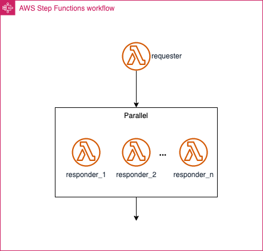
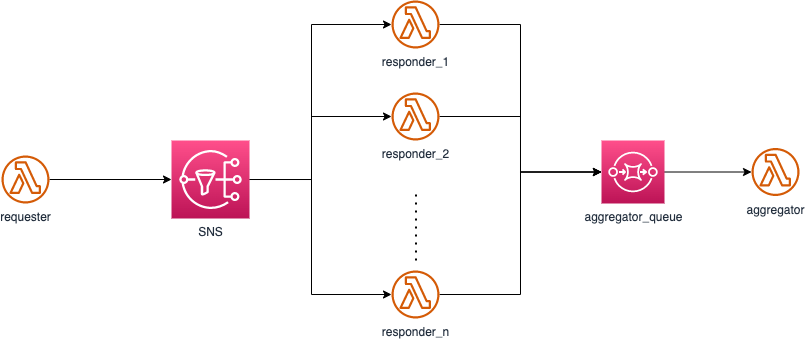

# Replace Parallel state with SNS for Scatter-Gather refactoring

## Description

AWS Step Functions Parallel-state can be used to implement the Scatter-Gather integration pattern: route a request message to multiple recipients and re-aggregates the responses into a single response message. There are two variants of Scatter-Gather that use different mechanisms to send the request messages to the intended recipients:

* Distribution via a Recipient List allows the Scatter-Gather to control the list of recipients but requires the Scatter-Gather to be aware of each recipient's message channel.
* Auction-style Scatter-Gathers use a Publish-Subscribe Channel to broadcast the request to any interested participant. This option allows the Scatter-Gather to use a single channel but at the same time relinquishes control.

AWS Step Function Parallel state executes a pre-defined set of AWS Lambda functions in parallel with same input message. The output of each Lambda function is collected and aggregated by the Parallel state, and returned as a single result.



An example Workflow definition looks like that:

``` Python
    # Define the requester state
    requester = sfn_tasks.LambdaInvoke(self, "Requester",
        lambda_function=executors.requester,
        result_path="$",
        result_selector={"request": sfn.JsonPath.string_to_json(sfn.JsonPath.string_at("$.Payload.body"))},
        retry_on_service_exceptions=True
    )

    # Define the parallel state
    parallel_state = sfn.Parallel(self, "Parallel",
                                  result_selector={"quotes": sfn.JsonPath.object_at("$")})
    # Define the responder state
    resp_index = 1
    for resp_lambda in executors.responder:
        responder = sfn_tasks.LambdaInvoke(self, f"Responder-{resp_index}",
            lambda_function=resp_lambda,
            result_path="$",
            input_path="$.request",
            output_path="$.quote",
            result_selector={
                "quote": sfn.JsonPath.string_to_json(sfn.JsonPath.string_at("$.Payload.data"))
                },
            retry_on_service_exceptions=True
        )
        parallel_state.branch(responder)
        resp_index +=1
    
    # Create the state machine
    self.cfn_state_machine = sfn.StateMachine(self, f"{id_}scatter-gather-workflow",
        state_machine_name="ParallelStateForScatterGather",
        definition=requester.next(parallel_state),
        timeout=Duration.minutes(5)
    )
```

AWS Step Functions Parallel state provides a powerful and flexible way to implement the Scatter-Gather pattern, but there are some limitations and considerations that you should be aware of:

* Error Handling: If any of the parallel executions within a Parallel state fails, the entire state is considered as failed. However, you can use "Catch" and "Retry" fields to define custom error handling and retry policies for individual items.
* Completion: The Parallel state will wait for all parallel executions to complete before it moves to the next state in the workflow. This can lead to increased processing time if some executions take significantly longer than others.
* Cost: Step Functions has a cost associated with it based on the number of state transitions and the duration of execution. That could be the case for high-throughput scenarios.
* Complexity: The implementation with AWS CDK for Step Functions Parallel state may be more complex due to the need to define the state machine, states, and transitions. However, it provides better control over the workflow orchestration and error handling.

## Solution

Use AWS SNS to replace the Parallel state and implement Scatter-Gather pattern to simplify application complexity and architect for scale. The solution uses choreography for communication between components instead of orchestration as with AWS Step Functions.

Replace Step Functions ```Parallel``` step, send a message to SNS.



Using SNS and fan-out to Lambda functions to implement Scatter-Gather can simplify application complexity by decoupling sub-tasks, providing scalability and flexibility, enabling reusability, and allowing for asynchronous processing. This can make it easier to develop, test, and maintain complex workflows, while also improving application performance and reliability. However, the solution does not provide built-in aggregation of result messages and therefore implements aggregation using a DynamoDB table and a unique ID.

Lambda functions invoked in scatter-gather pattern:

``` Python
# CDK construct to create the lambda functions and destinations for both use cases
class LambdaStates(Construct):
    
    def __init__(self, scope: Construct, id_: str, requester_sns_topic:sns.ITopic = None, responder_sqs_queue:sqs.IQueue = None, **kwargs) -> None:
        super().__init__(scope, id_)
        
        requester_destination = None
        if requester_sns_topic is not None:
            requester_destination = destinations.SnsDestination(requester_sns_topic)
            
        self.requester = lambda_.Function(
            self,
            f"requester",
            runtime=lambda_.Runtime.PYTHON_3_9,
            code=lambda_.Code.from_asset(str(pathlib.Path(__file__).parent.joinpath("requester").resolve())),
            handler="app.lambda_handler",
            on_success=requester_destination,
            tracing=lambda_.Tracing.ACTIVE
        )
        
        responder_destination = None
        if responder_sqs_queue is not None:
            responder_destination = destinations.SqsDestination(responder_sqs_queue) 
        
        # list of responders based on vendors defined in cdk.json 
        car_rental_list = self.node.try_get_context("car_rentals")
        self.responder = []
        for vendor in car_rental_list:
            env = dict(car_rental_list[vendor])
            env['vendor'] = vendor
            self.responder.append(lambda_.Function(
                self,
                f"responder-{vendor}",
                runtime=lambda_.Runtime.PYTHON_3_9,
                code=lambda_.Code.from_asset(str(pathlib.Path(__file__).parent.joinpath("responder").resolve())),
                handler="app.lambda_handler",
                on_success=responder_destination,
                environment= env,
                tracing=lambda_.Tracing.ACTIVE
            )
        )
        
        self.aggregator = lambda_.Function(
            self,
            f"aggregator",
            runtime=lambda_.Runtime.PYTHON_3_9,
            code=lambda_.Code.from_asset(str(pathlib.Path(__file__).parent.joinpath("aggregator").resolve())),
            handler="app.lambda_handler",
            tracing=lambda_.Tracing.ACTIVE,
            timeout=Duration.seconds(10)
        )
```

CDK code to implement Scatter-Gather with SNS and SQS:

``` Python
class RefactoredlScatterGatherStack(Stack):

    def __init__(self, scope: Construct, construct_id: str, **kwargs) -> None:
        super().__init__(scope, construct_id, **kwargs)
        
        # create sns topic for requester (car rentals request)
        sns_fanout = sns.Topic(
            self, "ScatterTopic",
            topic_name="scatter-topic"
        )
        # create sqs queue for aggregator
        sqs_aggregator = sqs.Queue(self, "sqs-aggregator", visibility_timeout=Duration.seconds(90))
        lambdas = LambdaStates(self, "refactor-lambda", requester_sns_topic=sns_fanout, responder_sqs_queue=sqs_aggregator)
        # subscribe resposnders (car rentals) to sns topic to receive quote request
        for responder in lambdas.responder:
            sns_fanout.add_subscription(subscriptions.LambdaSubscription(responder))
        # subscribe aggregator to sqs queue containing generated price quotes
        lambdas.aggregator.add_event_source(_event.SqsEventSource(queue=sqs_aggregator, batch_size=len(lambdas.responder), max_batching_window=Duration.minutes(1)))
        
        # crate responder functions (car rentals)
        resp_index = 1
        for responder in lambdas.responder:
            CfnOutput(self, f"ResponderFunctionName-{resp_index}", value=responder.function_name)
            resp_index +=1
        
        # create simple dynamoDB table named QuoteAggregatorTable
        quote_table = dynamodb.Table(self, "QuoteAggregatorTable",
            partition_key=dynamodb.Attribute(
                name="quoteId",
                type=dynamodb.AttributeType.STRING),
            billing_mode=dynamodb.BillingMode.PAY_PER_REQUEST)
        # grant read/write permissions to lambdas.aggregator
        quote_table.grant_read_write_data(lambdas.aggregator)
        lambdas.aggregator.add_environment("QUOTE_TABLE_NAME", quote_table.table_name)
```

### Assumptions

* Scatter-Gather variant with controlled recipient list.
* Sub-Tasks (scatter) need to be decoupled and independent.

### Advantages

* Decoupling: By using SNS to fan-out messages between sub-tasks, you can decouple the individual sub-tasks from each other and add further sub-tasks, reducing the complexity of the overall workflow. This can make it easier to modify or replace individual sub-tasks without affecting the rest of the system.
* Asynchronous processing: By using SNS with event and lambda destinations, you can implement asynchronous processing workflow, which can improve application performance and responsiveness.
* Complexity: The implementation with AWS CDK for SNS is relatively simpler, as you only need to define an SNS topic and subscribe one or more Lambda functions to that topic.

### Limitations

* Complexity: Implementing Scatter-Gather using SNS can add complexity to your application, as you need to manage aggregation of results. This can require additional development effort.
* Auditability: SNS does not provide same auditability as AWS Step Functions which allows to visualize and monitor the progress of your workflow via console or API.
* Traceability: To allow for message aggregation and enable request identification, each message needs to include an unique ID.

### Applicability

AWS SNS is best suited for workflows that involve small or moderately sized messages in a structured format, are relatively simple in nature, and do not require a high degree of control and orchestration. It is suitable for loosely coupled systems, allowing for asynchronous processing. While SQS for aggregation does provide some error handling and fault tolerance features, such as retries and visibility timeouts, more complex error handling may be better managed by Step Functions. SNS integrates well with other AWS services, like Lambda, and can be more cost-effective for high-throughput scenarios. If your workflow requires more advanced features or capabilities, such as support for complex orchestration, advanced error handling, or processing large payloads, Step Functions may be a better option.

### Considerations

Choosing between AWS Step Functions Parallel state and AWS SNS depends on your use case and requirements. Use Step Functions if you need a tightly orchestrated workflow with built-in scatter-gather and error handling capabilities. Choose SNS for loosely coupled and asynchronous processing where you want to manage the aggregation of results separately.

## Related Refactorings

* [Extract Send Message](https://serverlessland.com/refactoring-serverless/extract-send-message)
  