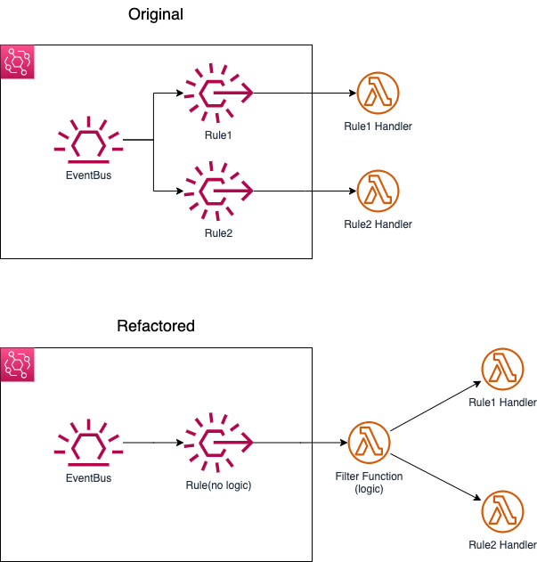

# Replace Event Pattern with Lambda

## Description

In some cases, Amazon EventBridge's event pattern matching might not be sufficient to filter events effectively. Complex filtering logic or data manipulation may be required before forwarding the events to the target service(s). For example, in an e-commerce application, you might need to filter events based on the number of items in an array, such as the number of purchased items in an order event. Event patterns in EventBridge do not provide built-in support for counting items in an array. In such scenarios, using an AWS Lambda function as a filter can provide additional flexibility and power to process and filter events before routing them to the desired targets.

## Solution

Use a Lambda function as an event filter instead of an EventBridge pattern rule. By doing this, the Lambda function acts as an intermediary filter, processing the incoming events and forwarding them to the target service(s) based on custom filtering logic.



### Original

``` typescript
const eventPatternFilterFunc1: events.EventPattern = {
      source: ['ecommerce.application'],
      detailType: ['user.review'],
      detail: {
        rating: [
          {
            numeric: ['>=', 4.5],
          },
        ],
      },
    };

    const eventPatternFilterFunc2: events.EventPattern = {
      source: ['ecommerce.application'],
      detailType: ['user.review'],
      detail: {
        rating: [
          {
            numeric: ['<', 2],
          },
        ],
      },
    };

    ...

    eventRuleFilter1.addTarget(new targets.LambdaFunction(lambdadestination_function_1));
    eventRuleFilterFunc2.addTarget(new targets.LambdaFunction(lambdadestination_function_2));
```

_Note_: The pattern logic does not provide built-in support for counting items in an array.

### Refactored

``` typescript

    const eventPatternPass: events.EventPattern = {
      source: ['ecommerce.application'],
      detailType: ['user.review'],
    };

    ...

    eventRulePass.addTarget(new targets.LambdaFunction(event_filter_function));


```

The lambda function provides the necessary logic to count items in an array and use it to filter and route messages.
([example event](/implementation/replace-eventpattern-with-lambda/example_event.json))

`/implementation/replace-eventpattern-with-lambda/lambda-fns/event-filter-function/index.py`
``` Python
def process_review_event(event):
    rating = event['detail']['rating']
    review_date = parse(event['detail']['reviewer']['signupDate'])
    days_since_signup = (datetime.now(timezone.utc) - review_date).days
    purchase_history = event['detail']['reviewer']['purchaseHistory']
    total_items_purchased = sum(item['quantity'] for order in purchase_history for item in order['items'])

    if rating >= 4.5 and days_since_signup <= 30:
        lambda_client.invoke(FunctionName=LAMBDA_DEST_FUNCTION_1, Payload=json.dumps(event))
    elif rating < 2 and total_items_purchased > 10:
        lambda_client.invoke(FunctionName=LAMBDA_DEST_FUNCTION_2, Payload=json.dumps(event))
```

## Advantages

- Greater flexibility: Lambda functions provide more control over filtering logic, allowing for complex conditions and data manipulation.
- Scalability: Lambda functions automatically scale based on the incoming event rate.
- Reusability: Lambda functions can be used across multiple EventBridge rules, reducing code duplication.
- Debugging and Monitoring: Lambda functions offer better debugging and monitoring capabilities through CloudWatch Logs, X-Ray, and other AWS services.

## Limitations

- Increased complexity: Using a Lambda function as a filter adds complexity to the overall architecture.
- Additional cost: Executing Lambda functions incurs additional costs based on the number of requests and duration.
- Latency: Introducing a Lambda function in the event processing flow may add latency to event handling.

## Applicability

This solution is applicable in scenarios where:

- Complex filtering logic or data manipulation is required before forwarding events to the target service(s), such as counting items in an array.
- Events need to be enriched, aggregated, or transformed before being sent to the target service(s).
- Multiple event sources need to be processed using a common filtering logic.

## Considerations

Using a Lambda function as an event filter for Amazon EventBridge can offer greater flexibility and control over filtering logic. However, it also introduces additional complexity, cost, and potential latency. This solution is most suitable for scenarios that require complex filtering, data manipulation, or enrichment before routing events to the target service(s). Carefully evaluate the trade-offs and requirements before implementing this approach.
