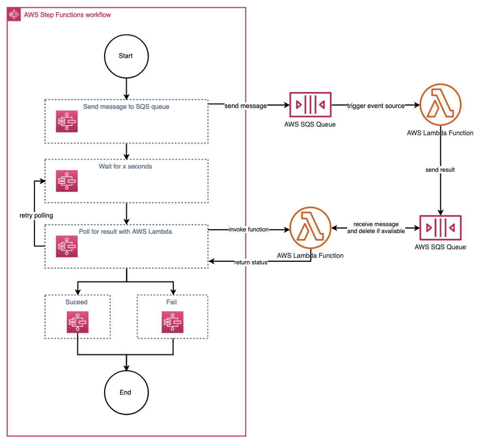

# Replace Polling with Callback

## Description

Step Functions provide integration patterns to interact with services invoked. Waiting for a long-running process might lead users to build a polling workflows including control flows (e.g. Choice, Map, Wait) or calls made against other AWS services (e.g. LambdaInvoke). This would lead to the before architecture shown below where a Lambda function is invoked repeatedly after a specified wait period to continue with the workflow once the message was processed. 

An example might look as follows:

## Solution

Use [Step Function's Callback Integration Pattern](https://docs.aws.amazon.com/step-functions/latest/dg/connect-to-resource.html) to call a service with a task token and have Step Functions wait until that token is returned with a payload.

For a CDK implementation written in Typescript, please see [replace_polling_with_callback](../implementation/replace-polling-with-callback/#).

## Considerations 

### Advantages
* The Step function state machine workflow waits until the callback token is received. This abandons the need for a polling machanism and reduces the number of function integrations. 

### Applicability

* The Wait for a Callback with the Task Token Integration Pattern is available for [supported services only] (https://docs.aws.amazon.com/step-functions/latest/dg/connect-supported-services.html). 

## Related Refactorings
[Extract Send Message](extract_send_message.md)
