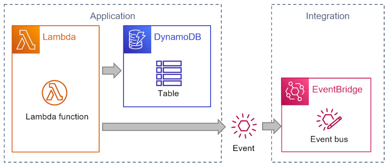
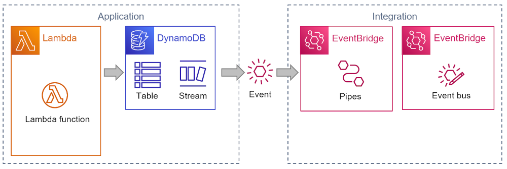

# Extract Message Router

Original:


Refactored:


## Description

Updating a DynamoDB item and then sending a message to EventBridge or SNS from Lambda function code creates tighter coupling between event source and destination. It also runs the risk of inconsistent state in case one operation fails.

An example might look as follows:

```
# Initialise clients
const AWS = require('aws-sdk');
const dynamodb = new AWS.DynamoDB.DocumentClient();
const eventBridge = new AWS.EventBridge();

domain_object =   # business logic here

await dynamodb.put(domain_object).promise();

domain_object_status_changed_event = {
    # set fields
}
await eventBridge.putEvents(
      Entries: [
        {
          Source: 'my-source',
          DetailType: 'order-details',
          Detail: JSON.stringify(domain_object_status_changed_event),
          EventBusName: process.env.EVENT_BUS_NAME
        },
      ],
    }).promise();


```

## Solution

Connect an Amazon EventBridge Pipes instance to a DynamoDB Stream (see [docs](https://docs.aws.amazon.com/eventbridge/latest/userguide/eb-pipes-dynamodb.html)) and use EventBridge Pipe to send message to target.
You can find the CDK implementation of this solution [here](https://github.com/aws-samples/aws-refactoring-to-serverless/blob/main/implementation/send-message-via-pipes/README.md).

## Considerations 

### Advantages
* Sending the event message is now handled by the serverless run-time without any additional code
* The event destination is now explicitly set within automation code as opposed to in the aplication code via an environment variable. This makes the application topology more explicit.
* The event format can be changed without changing the source code
* DynamoDB assures transactional integrity across updating the table and sending the event

### Applicability

* DynamoDB streams populate the event in the DynamoDB format, which isn't well suited for downstream consumers. Use thge Pipes transformation step to convert the event into a domain-oriented format without DynamoDB specifics.

* The additional Pipes instance will incur a run-time cost

* Pipes has less flexibility over some field definitions than the source code, e.g. `Source` and `DetailType`


## Related Refactorings
* Replace Send Message with Lambda Destination
