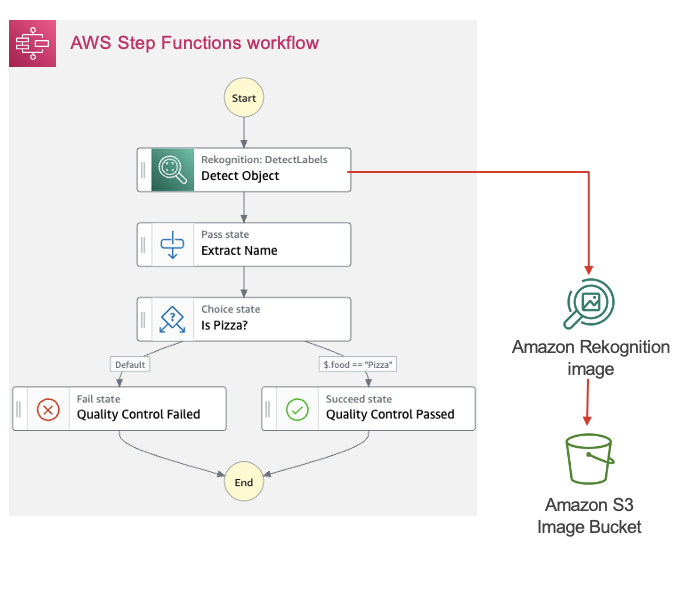

# Replace Lambda with Service Integration



## Description
As part of your AWS Step Functions workflow, if you want to integrate with other AWS Services like Amazon Rekognition to detect object in an image (diagram above), run an AWS Batch job and then perform actions based on results, or run an Amazon Elastic Container Service (Amazon ECS) task and wait for it to complete, you had to write a custom AWS Lambda function to handle each step of that service integration.
 
An example of custom Lambda making Rekognition call might look as follows:

```
const aws = require('aws-sdk');
const rekognition = new aws.Rekognition();


exports.handler = async (event,context, callback) => {
    ...
    result = await rekognition.detectLabels(params).promise();
    ...
}
```

## Solution
Use Step Functions' [SDK Service Integration](https://docs.aws.amazon.com/step-functions/latest/dg/supported-services-awssdk.html) to directly call each AWS Service's API directly from your worklow.

For CDK implementation of this pattern, [please see here](/implementation/service_integration/#).


## Considerations 

### Advantages
* You eliminate a run-time element (AWS Lambda) and thus reduce cost and run-time complexity.
* You reduce a little latency by eliminating the extra service hop.

### Limitation
* You might lose the ability to decouple the API syntax from Step Functions, e.g. by setting defaults or post-processing results in the Lambda function.

### Applicability

* Service Integration can invoke almost all AWS SDK APIs. See [the documentation](https://docs.aws.amazon.com/step-functions/latest/dg/supported-services-awssdk.html#unsupported-api-actions-list) for limitations 
* Cost: If you can replace the Lambda invocation with a single Step Functions state, the Step Functions cost remains but you save the Lambda execution cost. if you require an additional step, e.g. a pass state, standard workflows cost $0.025 per 1,000 state transitions, or roughly 1.5 Lambda GB-second. Express Workflow pricing matches Lambda pricing per GB-sec \[validate\]

## Related Refactorings
[Direct database access](patterns/direct_database_access.md)
